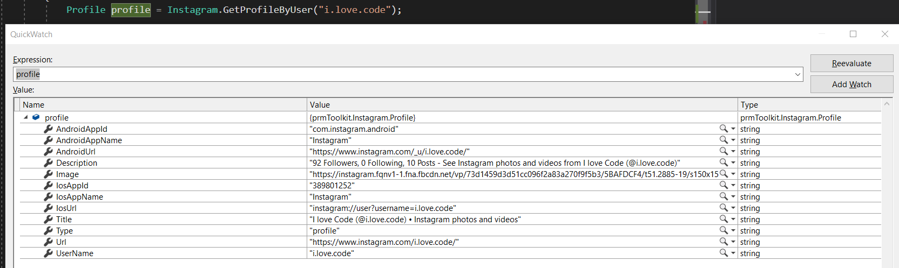

# prmToolkit
# Instagram
Provê informações do instagram sem API oficial

### Installation - Instagram

Para instalar, abra o prompt de comando Package Manager Console do seu Visual Studio e digite o comando abaixo:

Para adicionar somente a referencia da dll
```sh
Install-Package prmToolkit.Instagram
```

### Obtendo dados do usuário
```sh
 Profile profile = Instagram.GetProfileByUser("i.love.code");

```        





# VEJA TAMBÉM
## Cursos baratos!
- [Meus cursos](https://olha.la/udemy)

## Novidades, cupons de descontos e cursos gratuitos
https://olha.la/ilovecode-receber-cupons-novidades

